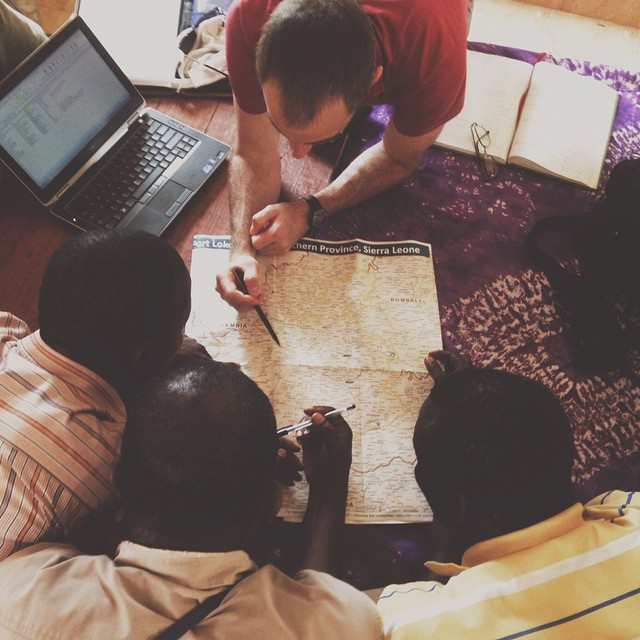

--- 
title: 'Public Health Information among Crisis-Affected Populations'
# title: |
#   |  Public Health 
#   | Information among 
#   | Crisis-Affected 
#   | Populations
author: "Jonathan Polonsky"
date: "`r Sys.Date()`"
site: bookdown::bookdown_site
output: bookdown::gitbook
documentclass: book
bibliography: [phicap.bib]
biblio-style: apalike
link-citations: yes
colorlinks: yes
lot: yes
lof: yes
fontsize: 12pt
url: 'https\://epidemos.com/phicap/'
github-repo: epidemos/phicap
cover-image: img/sl_map.jpg
description: "A description of the public health information required to support crisis-affected populations, and a guide to employing the methods used to collect such information."
---


```{r setup, include=FALSE}
options(
  htmltools.dir.version = FALSE, formatR.indent = 2,
  width = 55, digits = 4, warnPartialMatchAttr = FALSE, warnPartialMatchDollar = FALSE
)

lapply(c('DT', 'citr'), function(pkg) {
  if (!requireNamespace(pkg)) install.packages(pkg)
})
```

# Preface {-}

```{r fig.align='center', echo=FALSE, include=identical(knitr:::pandoc_to(), 'html')}

```


You can write citations like this: `[@Ager2014]` which appear as: [@Ager2014]

<!-- ```{r include=FALSE} -->
<!-- # automatically create a bib database for R packages -->
<!-- knitr::write_bib(c( -->
<!--   .packages(), 'bookdown', 'knitr', 'rmarkdown' -->
<!-- ), 'packages.bib') -->
<!-- ``` -->

## Why read this book {-}


## Acknowledgments {-}


```{block2, type='flushright', html.tag='p'}
Jonathan Polonsky
```
